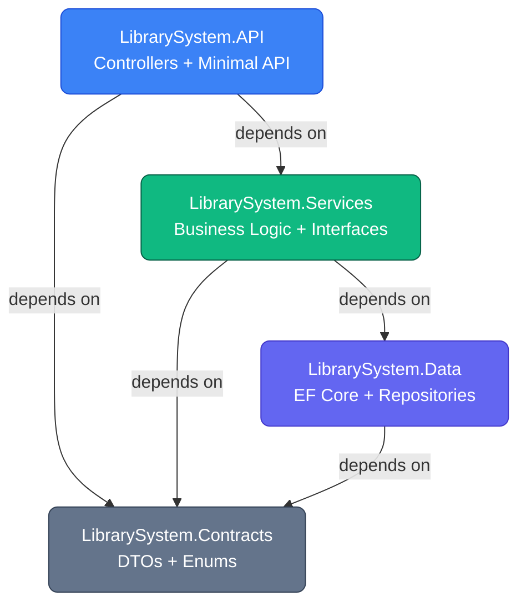
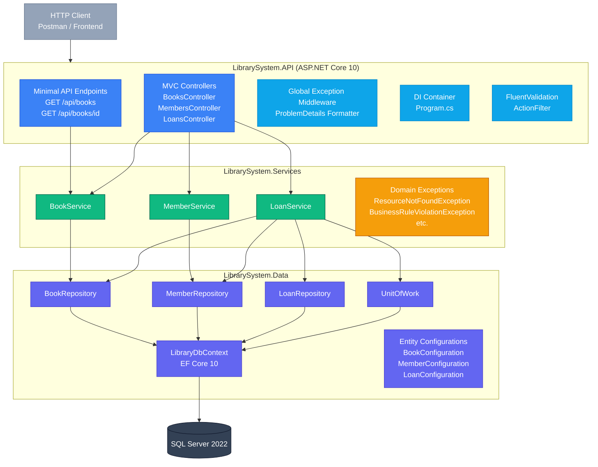
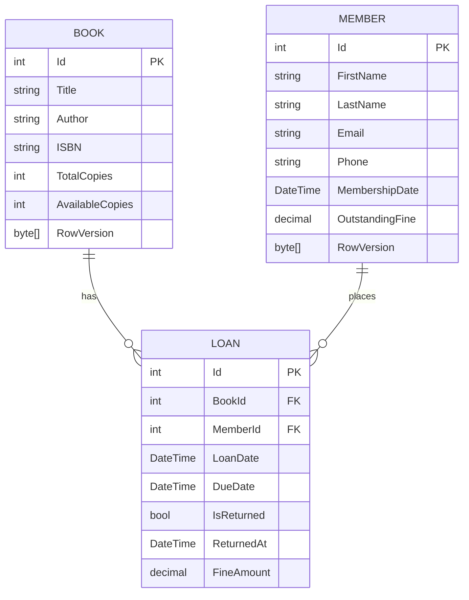
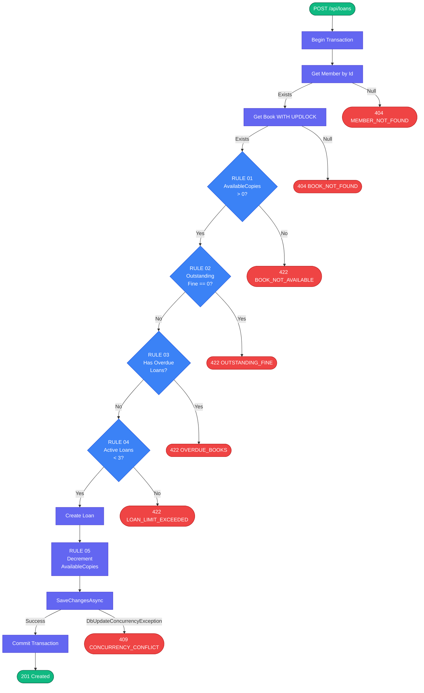
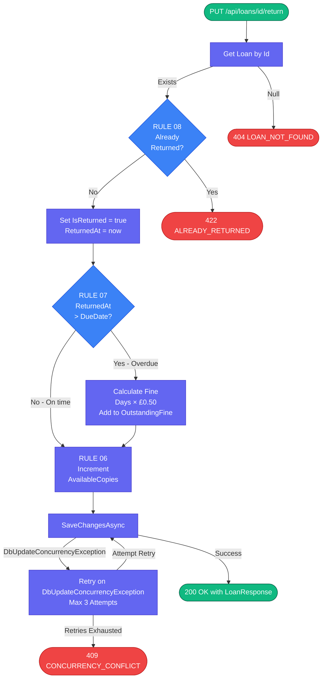
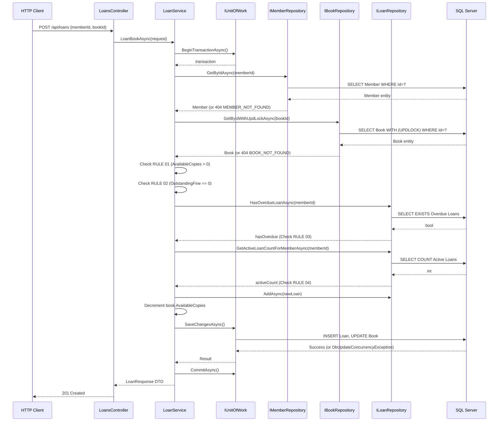

# 📚 Library Management System

A production-grade **Library Management System** REST API built with **.NET 10**, **ASP.NET Core Web API**, **EF Core 10**, and **SQL Server 2022**, following **Clean Architecture** principles with a strict, automatically-enforced dependency rule, full business-rule coverage, and a complete testing pyramid (Unit, Integration, Architecture, and Load tests).

---

## 📑 Table of Contents

1. [Overview](#-overview)
2. [Tech Stack](#-tech-stack)
3. [Architecture](#-architecture)
4. [Solution Structure](#-solution-structure)
5. [Database Schema (ERD)](#-database-schema-erd)
6. [Domain Entities](#-domain-entities)
7. [API Endpoints](#-api-endpoints)
8. [Business Rules](#-business-rules)
9. [Borrow Flow (Sequence Diagram)](#-borrow-flow-sequence-diagram)
10. [Exception Handling](#-exception-handling)
11. [Testing Strategy](#-testing-strategy)
12. [Performance & Load Testing](#-performance--load-testing)
13. [Development Roadmap](#-development-roadmap)
14. [Future Improvements](#-future-improvements)

---

## 🧭 Overview

The Library Management System allows a public library to manage its **book catalogue**, **member registrations**, and the **borrowing/returning lifecycle** through a REST API. It is built to be realistic enough to exercise every layer of a Clean Architecture while remaining implementable within a short development cycle.

### Framework Upgrade (.NET 10)

The application has been upgraded to leverage **.NET 10** and **EF Core 10**, utilizing C# 14 features for more concise business logic. This upgrade provides specific benefits directly relevant to this project, including enhanced startup performance, improved memory management during high-concurrency bursts (which positively impacted our load test latency), and more efficient query translation within EF Core 10.

### Scalability Considerations

| Dimension | Decision | Rationale |
|---|---|---|
| Horizontal scaling | Stateless API, no in-process session state | Any number of replicas can sit behind a load balancer without sticky sessions |
| Database | SQL Server with indexes on FKs, ISBN, email | Handles tens of thousands of concurrent members before read-replicas are needed |
| Concurrency | Pessimistic Locking with `UPDLOCK` & EF Core `RowVersion` | Prevents double-booking via database locks and optimistic concurrency handling |
| Paging | `GET /api/books` and `GET /api/loans` accept page/pageSize | Prevents unbounded queries as the catalogue grows |
| Caching | Read-heavy book catalogue can sit behind a Redis layer in front of `IBookService` | Clean layering enables this upgrade later without changing the API contract |

---

## 🛠 Tech Stack

| Layer | Technology |
|---|---|
| API | ASP.NET Core 10 (Minimal API + MVC Controllers) |
| ORM | EF Core 10 |
| Database | SQL Server 2022 |
| Validation | FluentValidation |
| Unit Testing | xUnit, Moq, Shouldly |
| Integration Testing | WebApplicationFactory, Testcontainers |
| Architecture Testing | NetArchTest |
| Load Testing | NBomber, JMeter |

---

## 🏗 Architecture

The system follows **Clean Architecture** with four projects — **API**, **Services**, **Data**, and **Contracts** — enforced by automated architecture tests. The dependency rule is strict: `API → Services → Data`, with `Contracts` shared across all layers. No layer may reference anything above it.

### Layer Responsibilities

| Layer | Project | Responsibility |
|---|---|---|
| Presentation | `LibrarySystem.API` | HTTP handling, model binding, response serialization, DI wiring, Minimal API endpoints |
| Application/Business | `LibrarySystem.Services` | All business rules, service interfaces, domain exceptions |
| Data | `LibrarySystem.Data` | EF Core DbContext, entities, EF configurations, repository implementations |
| Contracts | `LibrarySystem.Contracts` | DTOs (requests/responses) and shared enums, referenced by both API and Services |

### Dependency Flow



### High-Level Architecture



---

## 📂 Solution Structure

```text
LibrarySystem/
│
├── src/
│   ├── LibrarySystem.API/
│   │   ├── Controllers/          → BooksController, MembersController, LoansController
│   │   ├── Endpoints/            → BookEndpoints (Minimal API)
│   │   ├── Middleware/           → GlobalExceptionMiddleware
│   │   ├── Extensions/           → ServiceCollectionExtensions, WebApplicationExtensions
│   │   ├── Filters/               → ValidationFilter
│   │   └── Program.cs
│   │
│   ├── LibrarySystem.Services/
│   │   ├── Services/Interfaces/   → IBookService, IMemberService, ILoanService
│   │   ├── Services/Implementations/ → BookService, MemberService, LoanService
│   │   └── Exceptions/            → ResourceNotFoundException, BusinessRuleViolationException, ConcurrencyException, ErrorCode (Enum)
│   │
│   ├── LibrarySystem.Data/
│   │   ├── Context/               → LibraryDbContext
│   │   ├── Entities/               → Book, Member, Loan
│   │   ├── Configurations/         → EF Core IEntityTypeConfiguration<T>
│   │   ├── Interfaces/             → Repository Interfaces + IUnitOfWork
│   │   ├── Repositories/           → Repository Implementations + UnitOfWork
│   │   └── Seeds/                  → DatabaseSeeder
│   │
│   ├── LibrarySystem.Contracts/
│   │   ├── Requests/                → CreateBookRequest, CreateMemberRequest, LoanBookRequest
│   │   └── Responses/               → BookResponse, MemberResponse, LoanResponse, ErrorResponse
│   │
│   └── LibrarySystem.Infrastructure/
│       └── Providers/               → SystemDateTimeProvider
│
├── tests/
│   ├── LibrarySystem.UnitTests/
│   ├── LibrarySystem.IntegrationTests/
│   ├── LibrarySystem.ArchitectureTests/
│   └── LibrarySystem.LoadTests/
│
├── jmeter/
└── LibrarySystem.sln
```

---

## 🗺️ Database Schema (ERD)



---

## 🧩 Domain Entities

### Book

| Property | Type | Notes |
|---|---|---|
| `Id` | `int` | Primary key |
| `Title` | `string` | Required, max 200 chars |
| `Author` | `string` | Required, max 150 chars |
| `ISBN` | `string` | Unique, exactly 13 numeric digits |
| `TotalCopies` | `int` | Must be ≥ 1 |
| `AvailableCopies` | `int` | 0 ≤ value ≤ `TotalCopies`; concurrency-protected |
| `RowVersion` | `byte[]` | EF Core optimistic concurrency token |

### Member

| Property | Type | Notes |
|---|---|---|
| `Id` | `int` | Primary key |
| `FirstName` | `string` | Required |
| `LastName` | `string` | Required |
| `Email` | `string` | Unique, max 320 chars |
| `Phone` | `string` | Required |
| `MembershipDate` | `DateTime` | Joined date |
| `OutstandingFine` | `decimal` | Starts at 0; borrow requires this to be 0 (RULE 02) |
| `RowVersion` | `byte[]` | EF Core optimistic concurrency token |

### Loan

| Property | Type | Notes |
|---|---|---|
| `Id` | `int` | Primary key |
| `BookId` / `MemberId` | `int` | Foreign keys |
| `LoanDate` | `DateTime` | Set automatically to UTC now |
| `DueDate` | `DateTime` | Always `LoanDate + 14 days` |
| `IsReturned` | `bool` | True if the book was returned |
| `ReturnedAt` | `DateTime?` | Null while on loan |
| `FineAmount` | `decimal` | `(ReturnedAt - DueDate).Days × £0.50` if overdue (RULE 07) |

---

## 🔌 API Endpoints

| Method | Route | Auth | Description |
|---|---|---|---|
| `GET` | `/api/books` | None | List all books |
| `GET` | `/api/books/{id}` | None | Get a single book by ID |
| `POST` | `/api/books` | None | Create a book |
| `GET` | `/api/members/{id}` | None | Get a member |
| `POST` | `/api/members` | None | Register a member |
| `POST` | `/api/loans` | None | Borrow a book |
| `PUT` | `/api/loans/{id}/return` | None | Return a borrowed book |
| `GET` | `/api/loans` | None | List loans (filterable) |

### Example — `POST /api/loans` (success)

```json
{
  "id": 42,
  "bookId": 3,
  "bookTitle": "Domain-Driven Design",
  "memberId": 1,
  "memberName": "Jane Doe",
  "loanDate": "2026-06-08T10:30:00Z",
  "dueDate": "2026-06-22T10:30:00Z",
  "isReturned": false,
  "returnedAt": null,
  "fineAmount": 0.00
}
```

### Borrow Error Responses

| Scenario | Status | Error Code |
|---|---|---|
| Member not found | 404 | `MEMBER_NOT_FOUND` |
| Book not found | 404 | `BOOK_NOT_FOUND` |
| Book not available (RULE 01) | 422 | `BOOK_NOT_AVAILABLE` |
| Outstanding fine (RULE 02) | 422 | `OUTSTANDING_FINE` |
| Overdue books exist (RULE 03) | 422 | `OVERDUE_BOOKS` |
| Loan limit exceeded (RULE 04) | 422 | `LOAN_LIMIT_EXCEEDED` |
| Concurrency conflict | 409 | `CONCURRENCY_CONFLICT` |

---

## ⚖️ Business Rules

### Borrow Flow (`POST /api/loans`)



### Return Flow (`PUT /api/loans/{id}/return`)



### Rule Summary

| Rule | Description | Exception | Error Code |
|---|---|---|---|
| RULE 01 | Book must have `AvailableCopies > 0` | `BusinessRuleViolationException` | `BOOK_NOT_AVAILABLE` |
| RULE 02 | Member must have no outstanding fines | `BusinessRuleViolationException` | `OUTSTANDING_FINE` |
| RULE 03 | Member must have no overdue books | `BusinessRuleViolationException` | `OVERDUE_BOOKS` |
| RULE 04 | Member must have fewer than 3 active loans | `BusinessRuleViolationException` | `LOAN_LIMIT_EXCEEDED` |
| RULE 05 | `AvailableCopies` decremented atomically with `UPDLOCK` | — | — |
| RULE 06 | `AvailableCopies` incremented on return | — | — |
| RULE 07 | Fine = days overdue × £0.50, added to `OutstandingFine` | — | — |
| RULE 08 | Cannot return an already-returned loan | `BusinessRuleViolationException` | `ALREADY_RETURNED` |

---

## 🔄 Borrow Flow (Sequence Diagram)



---

## 🚨 Exception Handling

All domain exceptions derive from an abstract base and carry an `ErrorCode`. A `GlobalExceptionMiddleware` catches them and returns RFC 7807 Problem Details.

| Exception Class | HTTP Status | Mapped Error Codes |
|---|---|---|
| `ResourceNotFoundException` | 404 | `BOOK_NOT_FOUND`, `MEMBER_NOT_FOUND`, `LOAN_NOT_FOUND` |
| `BusinessRuleViolationException` | 422 | `BOOK_NOT_AVAILABLE`, `OUTSTANDING_FINE`, `LOAN_LIMIT_EXCEEDED`, `ALREADY_RETURNED`, `OVERDUE_BOOKS`, `INVALID_TOTAL_COPIES`, `BOOK_HAS_LOANS` |
| `ConcurrencyException` | 409 | `CONCURRENCY_CONFLICT` |

Example response shape:

```json
{
  "type": "https://library.api/errors/book-not-available",
  "title": "Book Not Available",
  "status": 422,
  "detail": "No available copies of 'Domain-Driven Design'. Current available copies: 0.",
  "errorCode": "BOOK_NOT_AVAILABLE"
}
```

---

## 🧪 Testing Strategy

| Test Type | Tool | Goal |
|---|---|---|
| Unit | xUnit + Moq + Shouldly | Verify every business rule in isolation |
| Integration | WebApplicationFactory + Testcontainers | Verify end-to-end HTTP flows against a real SQL Server container |
| Architecture | NetArchTest | Ensure layering rules are never violated |
| Load | NBomber + JMeter | Confirm system behavior under concurrency |

---

## ⚡ Performance & Load Testing

A dedicated JMeter load test was executed to validate the performance and concurrency handling of the system.

**Results Summary:**
- **Throughput**: 41.63 requests/second
- **Average Latency**: 6.22ms
- **Error Handling Validation**: 100% of business logic errors (e.g., `BOOK_NOT_AVAILABLE`, `LOAN_LIMIT_EXCEEDED`, `CONCURRENCY_CONFLICT`) were successfully captured and returned `422`/`409`/`404` HTTP status codes as expected.

This confirmed the effectiveness of the exception middleware, pessimistic locking (`UPDLOCK`), and EF Core's optimistic concurrency (`RowVersion`) in preventing double-booking and data anomalies.

---


