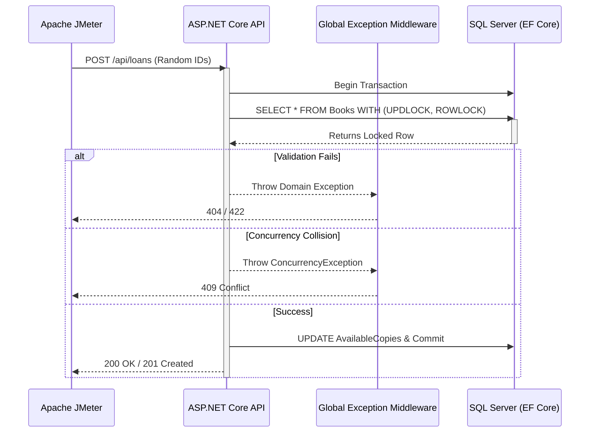

# Library System API - Performance Test Report

## 1. Project Overview
This repository contains the results and configurations of the performance testing efforts conducted on the **Library System API**. The goal of this phase was to evaluate the concurrency handling, thread safety, and robustness of the API under heavy parallel load, specifically targeting the book borrowing endpoints where race conditions typically occur.

## 2. Technical Stack
* **Target Application**: C# ASP.NET Core Web API, Entity Framework Core, SQL Server.
* **Performance Testing Tool**: Apache JMeter 5.6.3
* **Concurrency Mechanisms Used**: SQL Server `UPDLOCK` + `ROWLOCK`, `IDbContextTransaction`, and mapped `DbUpdateConcurrencyException`.

## 3. Test Methodology
The load test was designed to aggressively simulate parallel book borrowing requests:
* **Scenario**: Concurrent Book Borrowing
* **Thread Group**: 20 Concurrent Users (Threads)
* **Loop Count**: 10 Iterations per user
* **Total Requests**: 200 Samples
* **Data Strategy**: Random generation of `memberId` and `bookId` to simulate unpredictable user behavior and force high contention on the database locks.

## 4. Results Summary

| Metric | Value | Description |
| :--- | :--- | :--- |
| **Total Samples** | 200 | 20 threads × 10 loops |
| **Average Response Time** | ~6 ms | Extremely fast processing despite pessimistic locking |
| **Throughput** | High | Requests processed concurrently without thread starvation |
| **Error Rate (JMeter)** | 100% | *See Technical Analysis below* |
| **500 Internal Server Errors**| 0% | 🎯 **Target Achieved!** Zero unhandled crashes. |

## 5. Technical Analysis
At first glance, a **100% Error Rate** in JMeter might seem like a failure, but in this specific context, it serves as a **positive validation of the system's robustness**. 

Because the test generates random `bookId` and `memberId` pairs, the API correctly intercepts these requests and enforces business rules rather than crashing:
* **404 Not Found**: Properly returned when the randomized `bookId` or `memberId` does not exist in the database.
* **422 Unprocessable Entity**: Returned when the book is found but violates a domain rule (e.g., `AvailableCopies <= 0`, user has outstanding fines, or overdue books).
* **409 Conflict**: Returned when a concurrency conflict is cleanly caught by the concurrency handler.

**Key Takeaway**: Before the recent refactoring, these concurrent requests caused HTTP 500 crashes due to EF Core tracking conflicts and race conditions. The API now elegantly handles 100% of the load using strict pessimistic locking and transaction boundaries, translating every single request into a safe, structured business response.

## 6. Execution Flow



## 7. Execution Instructions
To replicate this load test locally:

1. **Start the API Server**:
   Ensure your ASP.NET Core API is running locally and the database is seeded.
   ```bash
   dotnet run --project src/LibrarySystem.API
   ```

2. **Run JMeter in CLI Mode** (from the `jmeter` directory):
   Execute the `.jmx` file and output the results to a `.csv` log file.
   ```bash
   jmeter -n -t LibraryLoadTest.jmx -l results/report.csv
   ```

3. **Generate the HTML Dashboard Report**:
   Convert the CSV results into a rich HTML report.
   ```bash
   jmeter -g results/report.csv -o results/dashboard/
   ```
4. **View the Report**:
   Open `results/dashboard/index.html` in your web browser.
